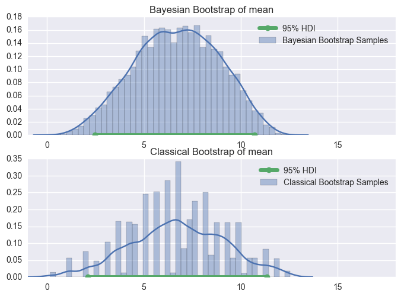
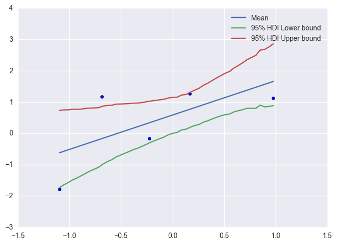

# `bayesian_bootstrap`  [](https://badge.fury.io/py/bayesian_bootstrap)

`bayesian_bootstrap` is a package for Bayesian bootstrapping in Python. For an overview of the Bayesian bootstrap, I highly recommend reading [Rasmus Bååth's writeup](http://www.sumsar.net/blog/2015/04/the-non-parametric-bootstrap-as-a-bayesian-model/).  This Python package is similar to his [R package](http://www.sumsar.net/blog/2016/02/bayesboot-an-r-package/). 

This README contains some examples, below. For the documentation of the package's API, see the [docs](http://htmlpreview.github.io/?https://github.com/lmc2179/bayesian_bootstrap/blob/master/docs/bootstrap_documentation.html).

This package is on pypi - you can install it with `pip install bayesian_bootstrap`.

# Overview of the `bayesian_bootstrap` module

This module contains tools for doing approximate bayesian inference using the Bayesian Bootstrap introduced in [Rubin's _The Bayesian Bootstrap_](https://projecteuclid.org/euclid.aos/1176345338).

It contains the following:

* The `mean` and `var` functions, which simulate the posterior distributions of the mean and variance

* The `bayesian_bootstrap` function, which simulates the posterior distribution of an arbitrary statistic

* The `BayesianBootstrapBagging` class, a wrapper allowing users to generate ensembles of regressors/classifiers
using Bayesian Bootstrap resampling. A base class with a scikit-learn like estimator needs to be provided. See also 
the `bayesian_bootstrap_regression` function.

* The `central_credible_interval` and `highest_density_interval` functions, which compute credible intervals from
posterior samples.

For more information about the function signatures above, see the examples below or the docstrings of each function/class.

One thing that's worth making clear is the interpretation of the parameters of the `bayesian_bootstrap`, `BayesianBootstrapBagging`, and `bayesian_bootstrap_regression` functions, which all do sampling within each bootstrap replication:

* The number of replications is the number of times the statistic of interested will be replicated. If we think about the classical bootstrap, this is the number of times your dataset is resampled. If we think about it from a bayesian point of view, this is the number of draws from the posterior distribution.

* The resample size is the size of the dataset used to calculate the statistic of interest in each replication. More is better - you'll probably want this to be at least as large as your original dataset.

# Example: Estimating the mean
Let's say that we observe some data points, and we wish to simulate the posterior distribution of their mean.

The following code draws four data points from an exponential distribution:
```
X = np.random.exponential(7, 4)
```
Now, we are going to simulate draws from the posterior of the mean. `bayesian_bootstrap` includes a `mean` function in 
the `bootstrap` module that will do this for you.

The code below performs the simulation and calculates the 95% highest density interval using 10,000 bootstrap replications. It also uses the wonderful 
`seaborn` library to visualize the histogram with a Kernel density estimate. 

Included for reference in the image is the same dataset used in a classical bootstrap, to illustrate the comparative 
smoothness of the bayesian version.
```
from bayesian_bootstrap import mean, highest_density_interval
posterior_samples = mean(X, 10000)
l, r = highest_density_interval(posterior_samples)

plt.title('Bayesian Bootstrap of mean')
sns.distplot(posterior_samples, label='Bayesian Bootstrap Samples')
plt.plot([l, r], [0, 0], linewidth=5.0, marker='o', label='95% HDI')
```

The above code uses the `mean` method to simulate the posterior distribution of the mean. However, it is a special 
(if very common) case, along with `var` - all other statistics should use the `bayesian_bootstrap` method. The
 following code demonstrates doing this for the posterior of the mean:

```
from bayesian_bootstrap import bayesian_bootstrap
posterior_samples = bayesian_bootstrap(X, np.mean, 10000, 100)
```



# Example: Regression modelling
<!--
Problem setup

Sample data points

Show scatterplot + code

Show posterior samples for slope

Show show scatterplot with prediction bands
-->
Let's take another example - fitting a linear regression model. The following code samples a few points in the plane.
The mean is y = x, and normally distributed noise is added.
```
X = np.random.normal(0, 1, 5).reshape(-1, 1)
y = X.reshape(1, -1).reshape(5) + np.random.normal(0, 1, 5)
```
We build models via bootstrap resampling, creating an ensemble of models via bootstrap aggregating. A 
`BayesianBootstrapBagging` wrapper class is available in the library, which is a bayesian analogue to scikit-learn's 
`BaggingRegressor` and `BaggingClassifer` classes.
```
m = BayesianBootstrapBagging(LinearRegression(), 10000, 1000)
m.fit(X, y)
```
Once we've got our ensemble trained, we can make interval predictions for new inputs by calculating their HDIs under the
ensemble:
```
X_plot = np.linspace(min(X), max(X))
y_predicted = m.predict(X_plot.reshape(-1, 1))
y_predicted_interval = m.predict_highest_density_interval(X_plot.reshape(-1, 1), 0.05)

plt.scatter(X.reshape(1, -1), y)
plt.plot(X_plot, y_predicted, label='Mean')
plt.plot(X_plot, y_predicted_interval[:,0], label='95% HDI Lower bound')
plt.plot(X_plot, y_predicted_interval[:,1], label='95% HDI Upper bound')
plt.legend()
plt.savefig('readme_regression.png', bbox_inches='tight')
```


Users interested in accessing the base models can do so via the `base_models_` attribute of the object.

# Contributions

Interested in contributing? We'd love to have your help! Please keep the following in mind:

* Bug fixes are welcome! Make sure you reference the issue number that is being resolved, and that all test cases in `tests` pass.

* New features are welcome as well! Any new features should include docstrings and unit tests in the `tests` directory.

* If you want to contribute a case study or other documentation, feel free to write up a github-flavored markdown document or ipython notebook and put it in the `examples` folder before issuing a pull request.

Credit for past contributions:

* [roya0045](https://github.com/roya0045) implemented the original version of the low-memory optimizations.
* [JulianWgs](https://github.com/JulianWgs) implemented the Bayesian machine learning model using weight distributions instead of resampling and a weighted Pearson correlation coefficient. He also refactored the weighted mean and covariance function to accept weight matrices.
* [genos](https://github.com/genos) simplified importing and updated the RNG usage to the current numpy standard.

# Further reading

* [_The Bayesian Bootstrap_, Rubin, 1981](https://projecteuclid.org/euclid.aos/1176345338)

* [Rasmus Bååth's original writeup on the Bayesian Bootstrap](http://www.sumsar.net/blog/2015/04/the-non-parametric-bootstrap-as-a-bayesian-model/)
